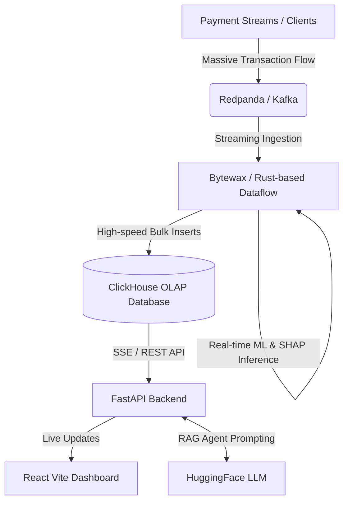

# 💳 BigTx-FraudPulse

**BigTx-FraudPulse** is a cutting-edge, high-throughput Big Data analytics and Explainable AI (XAI) fraud detection system. It processes millions of streaming financial transactions (Credit Card, FAST, EFT, Mobile QR) in real time using a modern event-driven architecture, classifies suspicious activities, and displays live metrics on a futuristic security SCADA dashboard.

---

## 🚀 Architecture & Tech Stack

The project implements a complete, production-grade Big Data pipeline:



*   **Ingestion Pipeline:** [Redpanda](https://redpanda.com/) (Developer-first, C++ based Kafka-compatible event broker) running on port `9092`.
*   **Stream Processing:** [Bytewax](https://bytewax.io/) (Rust-based stateful stream processing library for Python) aggregating and windowing transactions.
*   **Database (OLAP):** [ClickHouse](https://clickhouse.com/) (Column-oriented DBMS) storing logs and model results with ultra-fast write throughput.
*   **Model Diagnostics:** Explainable AI (XAI) calculations using **SHAP (SHapley Additive exPlanations)** weights to explain *why* the XGBoost classifier flagged an account.
*   **Backend Server:** [FastAPI](https://fastapi.tiangolo.com/) providing Server-Sent Events (SSE) for low-latency live streaming to the UI.
*   **Frontend Client:** React (Vite) styled with custom dark mode glassmorphism, Recharts visualization engine, and real-time canvas animations.

---

## 🎨 Futuristic SCADA Dashboard & Features

The frontend is a custom-themed Indigo/Purple fintech dashboard featuring:

### 1. 📊 Advanced Recharts Visualizations
*   **Live Area Timeline Chart:** Toggle between **⚡ Velocity** (tx/s and bot alerts), **💰 Tx Volume** (total TRY and blocked fraud), and **🧠 AI Risk** (threat scores and incident frequency).
*   **📍 City & Gateway Risk Distribution (New):** Horizontal BarChart comparing normal risk centers (Istanbul, Ankara, Izmir) against offshore hubs (Lefkoşa, Panama City, Grand Cayman) based on active streaming data.
*   **📐 Diagnostic Radar Chart:** Visualizes multi-dimensional risk parameters: Amount Risk, Velocity, Offshore IP routing, Night Activity, and Multi-card attempts.
*   **🔍 3D Transaction Scatter Chart:** Clusters live transactions along Amount (TRY) vs. Velocity (tx/s) coordinates, highlighting anomalies.
*   **🍰 Fraud Reason Breakdown (Pie Chart):** Real-time breakdown of fraud triggers (Velocity Limits, Offshore IP Routing, Amount Limits, Identity Theft).

### 2. 🚨 Real-Time Security Operations Center (SOC) Tools
*   **Live Response Logs (New):** A system audit trail displaying millisecond-level automated mitigation events (e.g. freezing credit cards, rejecting offshore wires, placing KYC validation holds).
*   **Interactive Anomaly Injector (New):** Inject simulated threat incidents into the Kafka pipeline:
    *   *Inject Bot Script:* High-frequency POS terminal card-scanning scripts.
    *   *Inject Offshore IP:* FAST wires routed from high-risk offshore routing networks.
    *   *Inject Limit Breach:* EFT transfers exceeding the single transaction KYC limit.
*   **Cyber Containment Actions:** Remotely trigger security overrides (Freeze Credit Card, Reject offshore IP, KYC Hold Account).

### 3. 🧠 MLOps Model Drift & Retraining Control
*   **Model Drift Monitor (New):** Live tracking of Population Stability Index (PSI) to detect concept drift in incoming transaction patterns.
*   **Online Model Retraining (New):** Trigger XGBoost online model updates on the fly using historical data loaded directly from ClickHouse.

---

## 🛠️ System Components

1.  **`iot_grid_stream.py` (Transaction Simulator):**
    Simulates high-velocity transactions across 9 regions (Levent HQ, Çankaya Branch, etc.), introducing anomalies like:
    *   `Bot_Script_v3`: High-frequency automated script transfers (Velocity limits exceeded).
    *   `CRITICAL_AMOUNT`: Extremely high transaction volumes breaching account limits.
    *   `OFFSHORE_IP`: Transactions originating from high-risk offshore nodes (Panama, Cayman Islands).
2.  **`grid_anomaly_detector.py` (AI Anomaly Classifier & XAI):**
    Consumes transactions from Kafka, scores them using a pre-trained classification model, computes **SHAP** feature contribution weights, and writes the results to ClickHouse.
3.  **`api.py` (FastAPI Server):**
    Exposes metrics, transaction history, and an SSE endpoint. Integrates a **FraudPulse AI Copilot** conversational agent equipped with Retrieval-Augmented Generation (RAG) to query ClickHouse transaction tables.
4.  **`App.jsx` (Vite Frontend):**
    A futuristic fintech dashboard showing live transactions, risk clustering, feature importance progress bars, active security overrides (Freeze Card, Hold Account), and a chat copilot.

---

## ⚙️ Quick Start & Installation

### Prerequisites
*   Windows / Linux / macOS
*   [Docker Desktop](https://www.docker.com/products/docker-desktop/)
*   Python 3.10+
*   Node.js v18+

### Step 1: Clone the Repository & Start Infrastructure
```bash
# Clone the repository
git clone https://github.com/propaper12/BigTx-FraudPulse.git
cd BigTx-FraudPulse

# Spin up Redpanda, ClickHouse, Dragonfly and Redpanda Console
docker compose up -d
```

### Step 2: Initialize Virtual Environment & Install Dependencies
```bash
# Create and activate virtual environment
python -m venv venv
source venv/bin/activate  # On Windows: .\venv\Scripts\activate

# Install Python packages
pip install -r requirements.txt
```

### Step 3: Run Backend Services
Run these in separate terminal windows or send them to the background:
```bash
# 1. Start the FastAPI backend
python -m uvicorn src.api:app --host 127.0.0.1 --port 8000

# 2. Run the real-time AI Fraud Detector
python src/grid_anomaly_detector.py

# 3. Start the transaction simulator stream
python src/iot_grid_stream.py
```

### Step 4: Run Vite Frontend
```bash
cd frontend
npm install --legacy-peer-deps
npm run dev
```

---

## 📊 Live Access URLs

Once everything is up, you can access the following services in your browser:

| Service | URL | Description |
| :--- | :--- | :--- |
| **Fintech Dashboard** | [http://localhost:5173](http://localhost:5173) | Live monitoring & security override console |
| **Redpanda Console** | [http://localhost:8080](http://localhost:8080) | Inspect Kafka partitions, topics, and message feeds |
| **FastAPI Swagger API** | [http://localhost:8000/docs](http://localhost:8000/docs) | Interactive API endpoints & model metadata |
| **ClickHouse Play** | [http://localhost:8123/play](http://localhost:8123/play) | Direct SQL querying playground |


